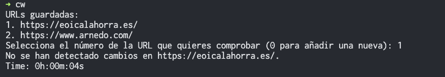

# Website checker CLI

Script en Python para comprobar si una web ha cambiado desde la última vez que se comprobó.



## Uso

### Instalación

```bash
./install.sh
```

### Ejecución

Cuando se ejecute por primera vez, se pedirá la URL que se desea comprobar.

```bash
cw
```

Una vez que existan URLs en la caché, se mostrará un listado de las URLs que se pueden comprobar.

```bash
cw <url_id>
```

Para introducir una nueva URL, se puede usar:

```bash
cw <url>
```

O bien, elegir la opción 0 en el menú de URLs y introducir la URL deseada.

